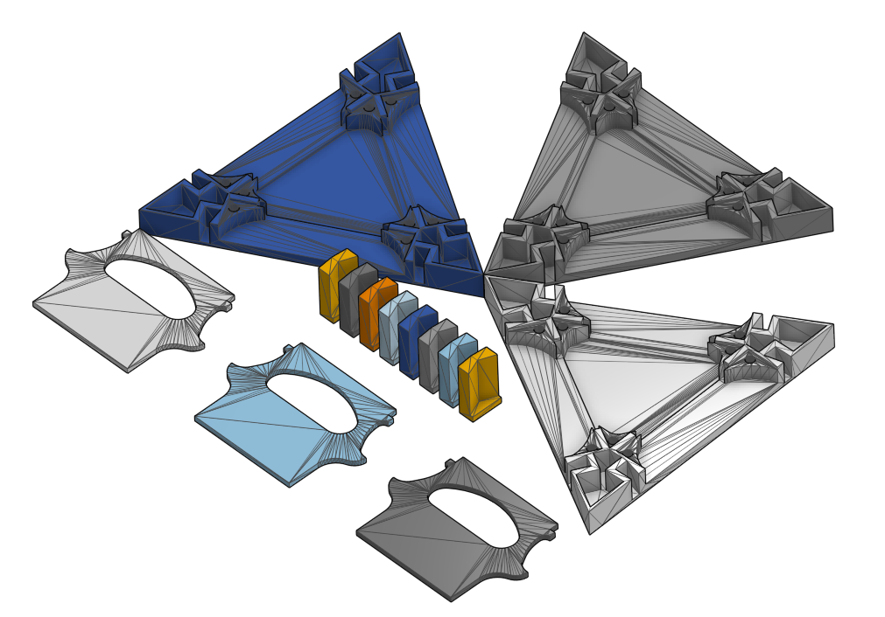
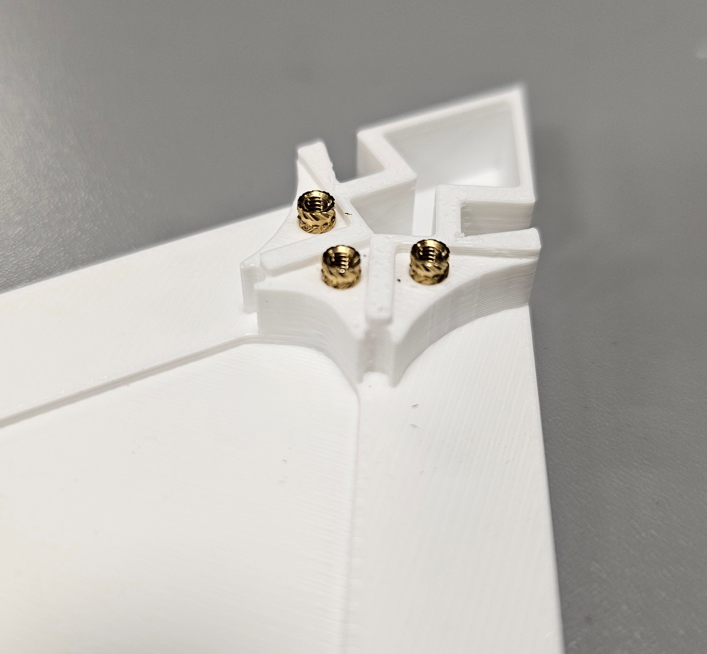
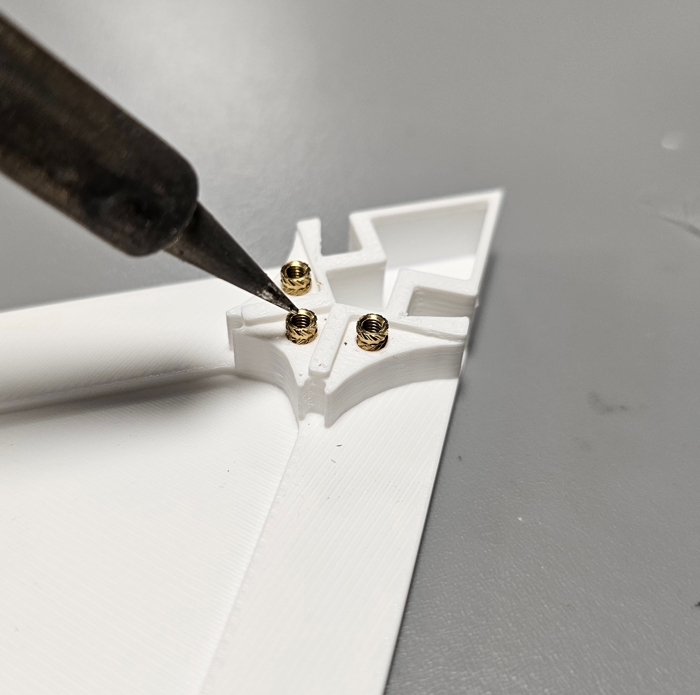
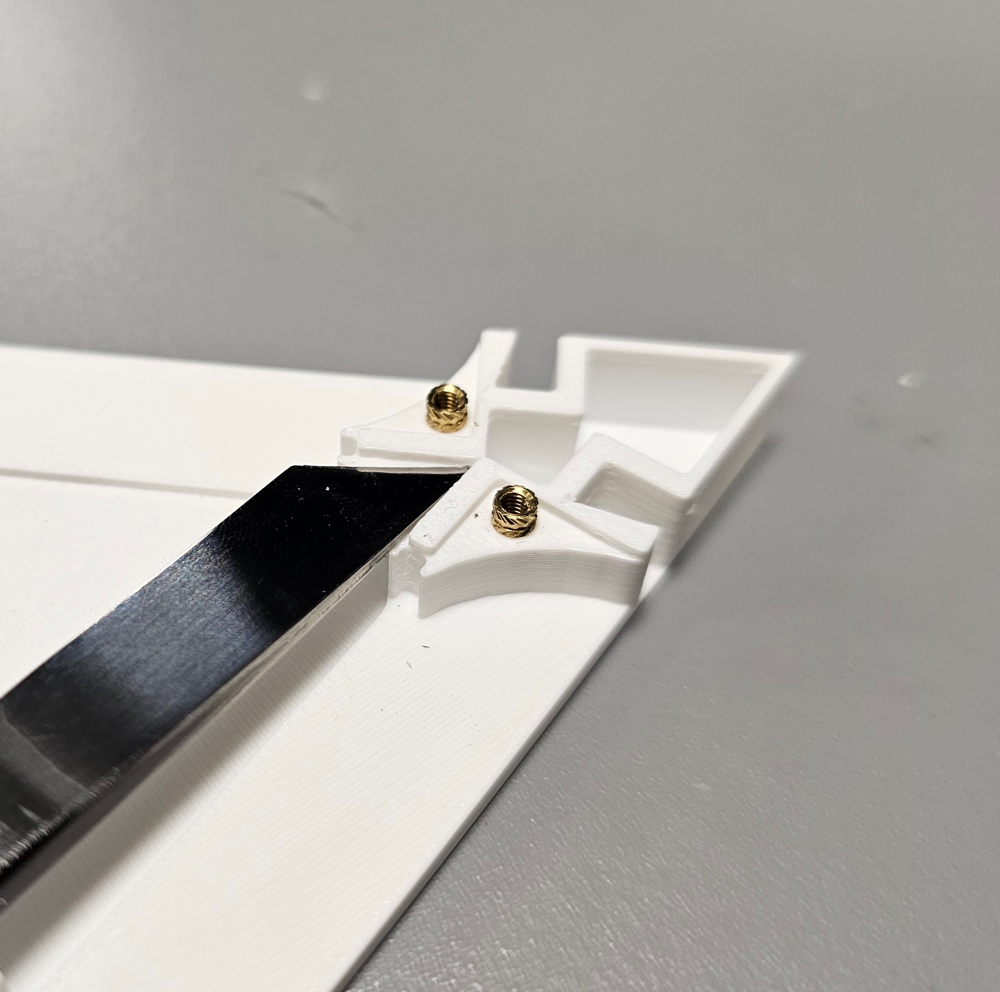
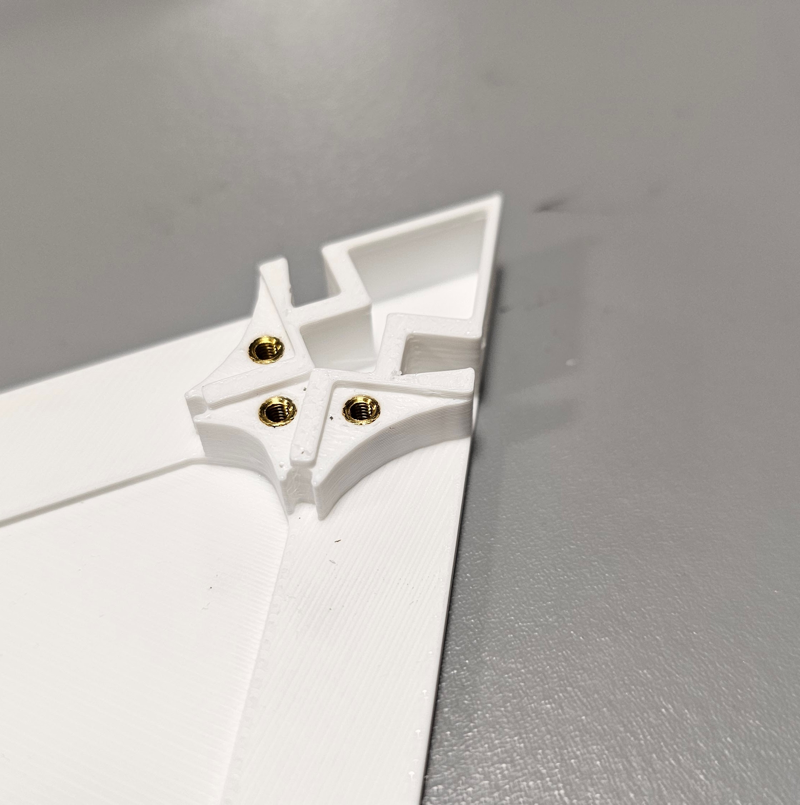
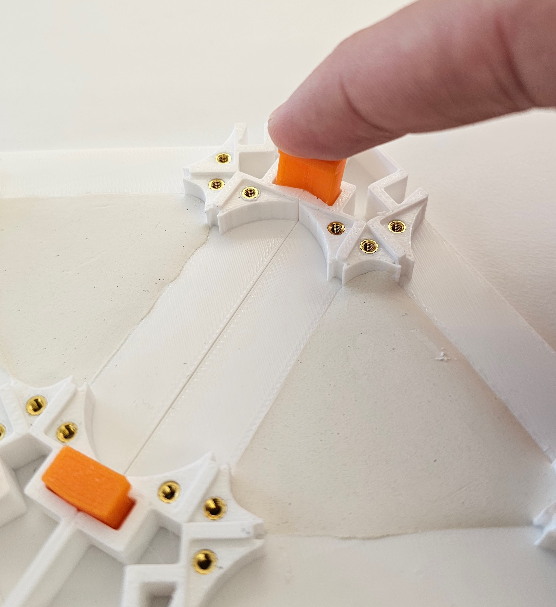
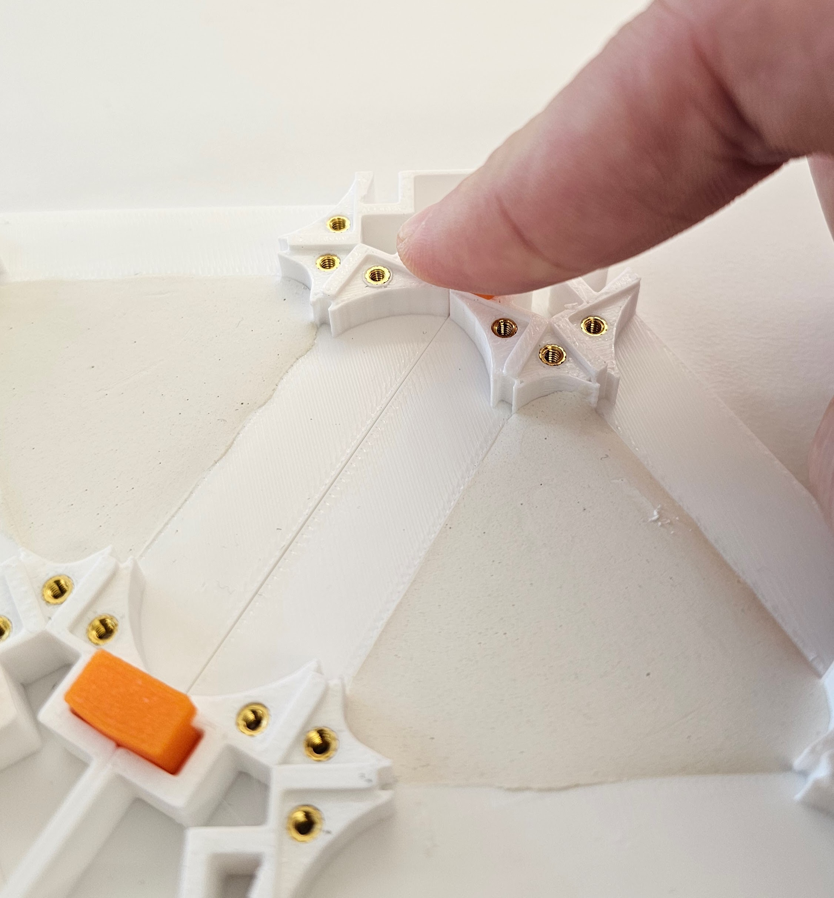
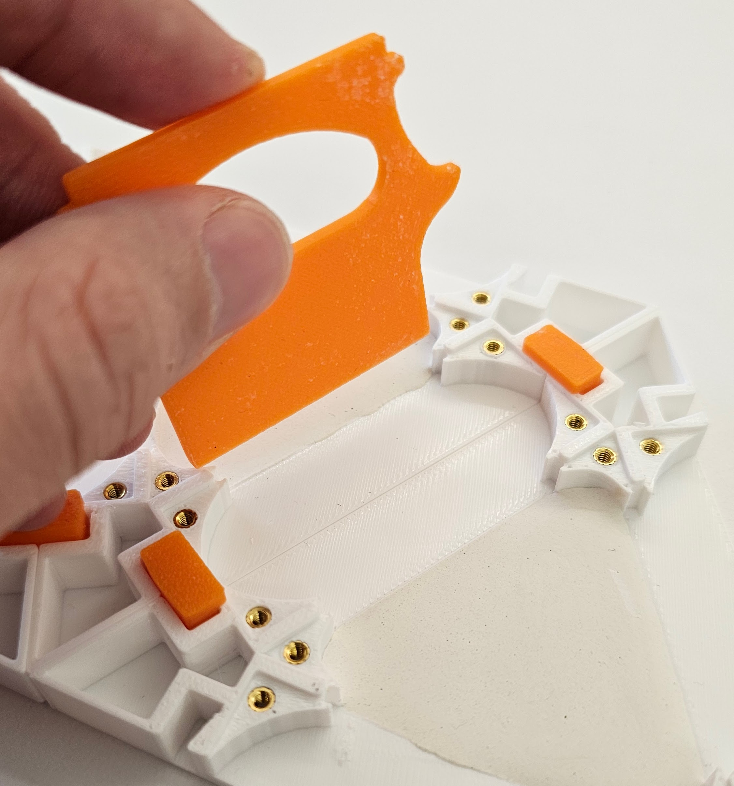
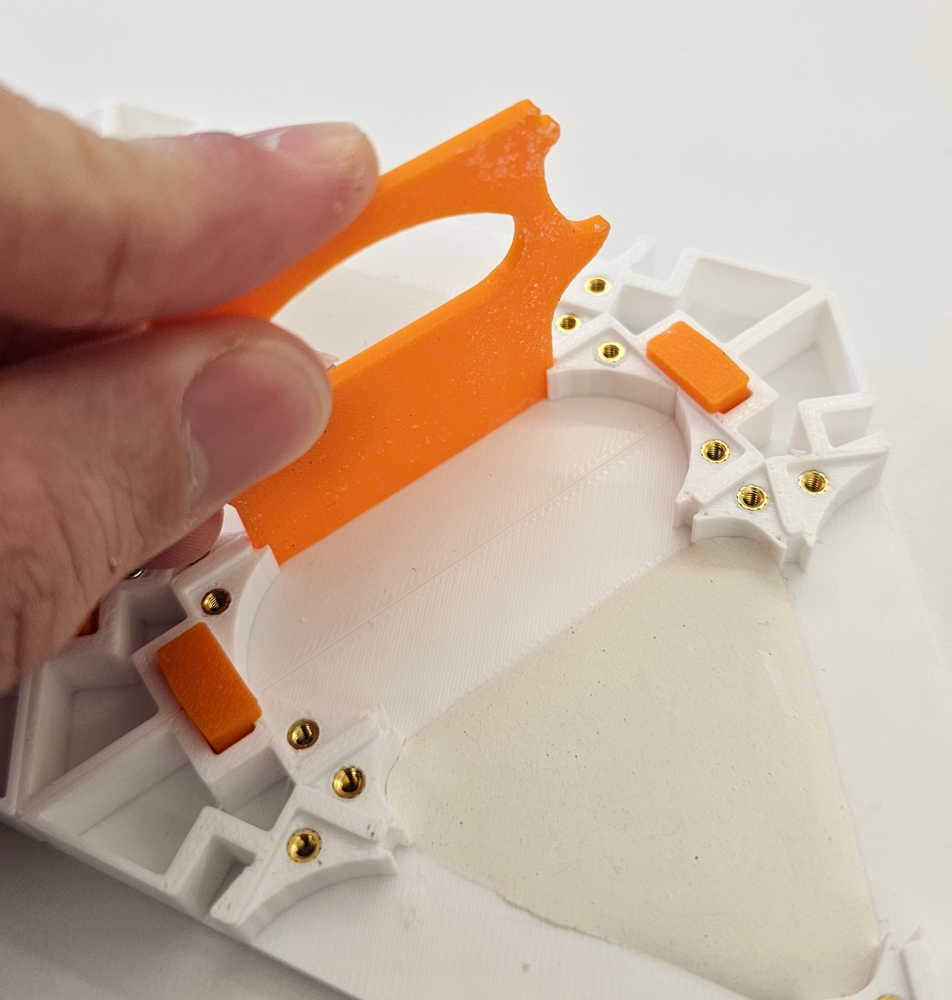

**Title** *OpenNest: A modular experimental setup for long term studies of collective behavior in ants*\
**Authors** Darryl Linardi, Michael Napoli, Roxy Nadim, Simon Garnier, Maurizio Porfiri\
**Presented At** *Animal Behavior Live, 2025*\
**Contact Information** Maurizio Porfiri (mporfiri@nyu.edu)

---

### Directory

* `acrylic/` Contains the acrylic lids corresponding to the arena and outer triangle compartments.
    * `hexagon-chamber.DXF` Stencil for cutting acrylic lids for the large hexagonal chamber.
    * `outer-triangle.DXF` Stencil for cutting acrylic lids for the outer triangular chamber.
* `print3d/` Contains all the necessary STL files, ready for any 3D printer.
    * `gate.STL` Print file for the gates (universal to all chambers).
    * `hexagon-chamber.STL` Print file for the large hexagonal chamber.
    * `inner-triangle_wall-N.STL` Print file for the inner triangular chambers. Each alternative has an index which indicates the number of walls.
    * `key-length.STL` Print file for the connecting keys. Two alternatives are provided: short and long. We recommend the short key to improve chamber security.
    * `outer-triangle.STL` Print file for the outer triangular chamber.
* `starter.STL` Our **recommended** print for any first-time users. Pieces are selected to help you understand how the mechanisms work.

---

### Instructions

The OpenNest environment can printed and prepared in just a few simple steps:

0. **Necessary Materials**
    * Before beginning the build, you will need:
        * M2 screws (we recommend size M2*6, but an assorted pack is linked [here](https://www.amazon.com/Screws-Metric-Machine-Plated-Washers/dp/B0D3X4LJD2/ref=sr_1_2_sspa?crid=25YHP8VWB5RN&dib=eyJ2IjoiMSJ9.Xe3zLQ7GMbVX4e9UdWnn14EnfhBGdotOSACG1_8kKogoOn2j_0cnoenaFMAFLcSbgOmfhz1MR3S5mKnTG6QaegCgTCRETSMpstPrWkrIubHm6GUDoi_Ixuk3aI5NiZdrm58_dUpLr2Pwc4DPvefS3MIJD6DOT0tRk1Bb5bvC2STnIdsiscMU8WN3PKgrjtDaKulVopjLPtJYpMsi2P6EM5Dk8RZA1DLBIgCJVsqpmJc.DHu31PCboK1zJ9SLzHXI5ekGwq2jxre0dm99Qhak0pg&dib_tag=se&keywords=m2%2Bscrews&qid=1762795158&sprefix=m2%2Bscrews%2Caps%2C113&sr=8-2-spons&sp_csd=d2lkZ2V0TmFtZT1zcF9hdGY&th=1)).
        * Heat-set threaded inserts (compatible with M2 screws; [here](https://www.amazon.com/HANGLIFE-Heat-Set-Threaded-Printing-Components/dp/B0CS6XJSSL/ref=sr_1_1_sspa?crid=2X401NN3CMTKH&dib=eyJ2IjoiMSJ9.Kklsn2ALETWMyH1Of0tnBMGeyleaKsQLK1W5VNXij61Y5oHJgMtm6qf76GHQ7P1Y1GGcDWXNXN1QW_88UgVfaOOg1zcjLnNU7YAKD6C6rtVxlGL1iBMCFGNB7Bzryu3UcULQHzL8BAD_Sxecmnw4laiOEHEvQCOZuRBGbdhFbsLFMGNXN-k45kH1JyEcazoDjLOGyYDA9RiJa1oudbD_UYvNhZhXZuymrawNj-a4z38.o9QLKDiO5OeRgJAPcX_pstp2KZFOAEUnRcBW7jLywxQ&dib_tag=se&keywords=heat%2Binsert%2Bthreads%2Bm2&qid=1762794633&sprefix=heat%2Binsert%2Bthreads%2Bm%2Caps%2C97&sr=8-1-spons&sp_csd=d2lkZ2V0TmFtZT1zcF9hdGY&th=1)).
        * Acrylic sheets (we recommend `+1/16` thick acrylic [here](https://www.amazon.com/Egofine-Plexiglass-Transparent-Crafting-Replacement/dp/B099DBW1PG/ref=sr_1_1_sspa?crid=15OU06PQF9TN1&dib=eyJ2IjoiMSJ9.4dILOJT7ySdvqRT2vG8Kzo9o9AKmPakZd5RwVmlmNYOYXsYmgCRCcOZv-nSL3H_jF73TlOOdkikMPIcm7mXO9wVv4r-yA3wP4KqRElr427ief8H_iKfYSkIP2uQLtaQvXzo2e_uTn2FjYP7r49_sJuV1BDqzGPWCSpNAn1tfsvbLdb6z2DvWVCbOnVxzsg5izID6YO5i93p_Q358TuVJVOWUiJyilbP0CmQI9jAqh8E.0RvwHecz896PtW5ECGpVm9cVpILleeXo2HvBdLd8Sv4&dib_tag=se&keywords=acrylic%2Bsheets&qid=1762795260&sprefix=acrylic%2Bsheets%2Caps%2C293&sr=8-1-spons&sp_csd=d2lkZ2V0TmFtZT1zcF9hdGY&th=1))
        * Soldering iron.
    * For first time prints we recommend using the `starter.STL` file!
        <p align="center">
        
        </p>
1. **Download or Clone the Repository**
    * Download the latest version of OpenNest from the official repository:
   ```bash
   git clone https://github.com/dynamicalsystemslaboratory/opennest.git
2. **3D Print the Nest Components**
    * Drag and drop the appropriate files from the `print3d/` directory into your favorite 3D print software.
    * Print each part using your preferred 3D print settings. If possible, we recommend white filament to make ants distinguishable from the background during videos.
3. **Install Heat-set Threaded Inserts**
    * Rest one of the threaded inserts above each of the holes located on the 3D print.
        <!-- <p align="center">
        
        </p> -->
    * Once heated up, gently press the threaded insert into the hole. Once flush with the plastic remove the soldering iron.
        <p align="center">
        
        </p>
    * *Optional*: We recommend also have a flat surface available that you can use to press the threaded insert flush with the plastic after you remove the soldering iron and while it cools.
        * In some cases, the heat of the soldering iron causes the plastic to expand upon removal, pushing the threaded insert back out of the hole.
        <p align="center">
        
        
        </p>
3. **Cut Acrylic Lids**
    * All the necessary stencils are provided in `acrylic/`.
4. **Assemble the Nest**
    * At this point, you are ready to assemble the nest!
    * Use the keys to connect the various compartment types.
        <p align="center">
        
        
        </p>
    * Shut the gates to close off pathways for escape!
        <p align="center">
        
        
        </p>
